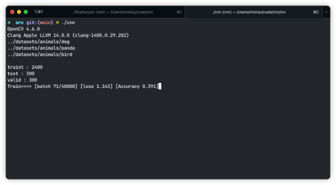
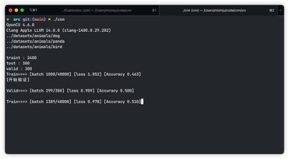

# cnn-classification
C++实现的简易CNN，实现简单的图片分类（虽然效果不是很理想）


## 运行方式
```bash
# 拉取代码
git clone https://github.com/Tom-debug110/cnn-classification.git


# 构建项目
cd cnn
mkdir build
cd build
cmake ..
make 

# 运行，CMake 中指定了可执行文件的生成路径
../src/cnn

```

经过测试，目前的代码应该还是有问题，因为在Ubuntu20.04 上是无法运行的
会出现段错误，估计是访存出错了，但是在Mac OS 13.1上，使用 ARM架构的 gcc11 
进行编译和构建没有什么大的问题，这个具体原因我暂时还没找到






## 待提升的地方

1. CMakeLists.txt 有待加强，测试模块不够自动化
2. 单元测试较为单薄，为引入单元测试框架如 GoogleTest
3. 注释未补全
4. 算法效率太低，考虑使用C++多线程或协程来并行处理
5. 验证部分计算正确率应该是有点问题的


